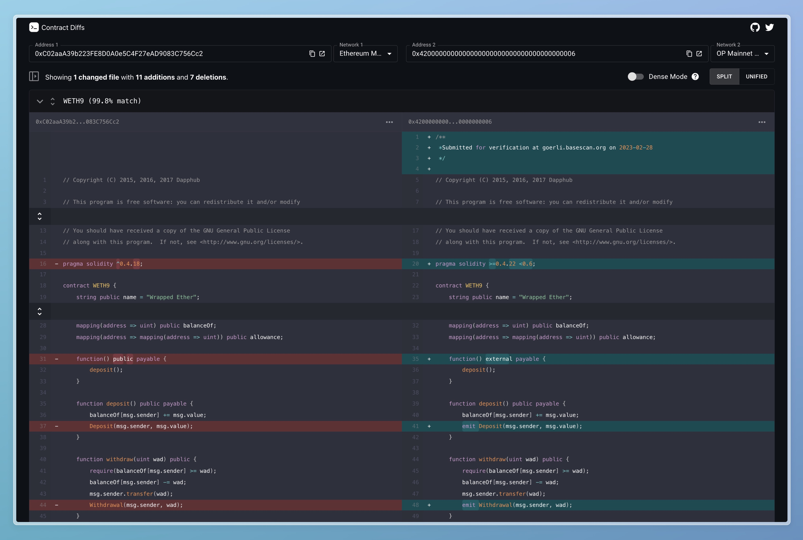

# Contract Diffs

A tool for comparing contracts across many chains.[^1]

## Features

- Massively multichain (supports ~300 chains).
- Automatically fetch source code.
- Multifile support.
- Auto-formats contracts using prettier to remove formatting diffs.
- Optional dense mode to remove comments and whitespace from diffs.
- Split mode and unified mode.
- Solidity syntax highlighting.
- Diff summaries.
- File explorer.

Below is an example diff, which can be viewed at [here](https://contracts.evmdiff.com/diff?address1=0xC02aaA39b223FE8D0A0e5C4F27eAD9083C756Cc2&chain1=1&address2=0x4200000000000000000000000000000000000006&chain2=10).

[^1]: Forked from https://github.com/x48115/contract-diff-tool which is no longer maintained
